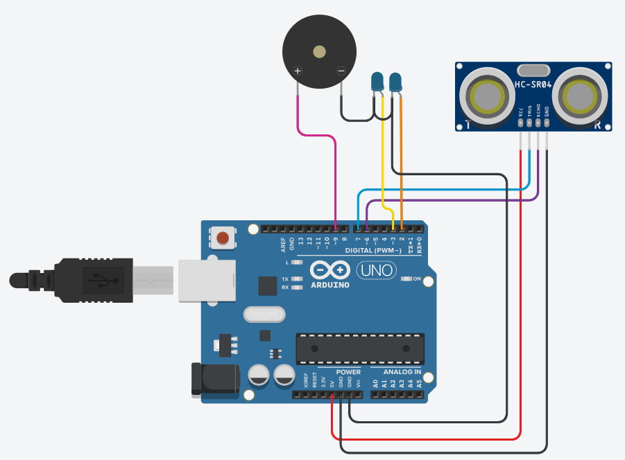
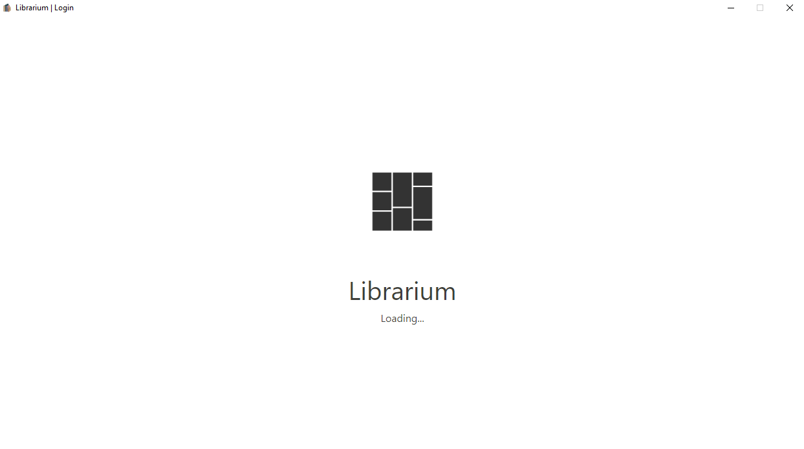
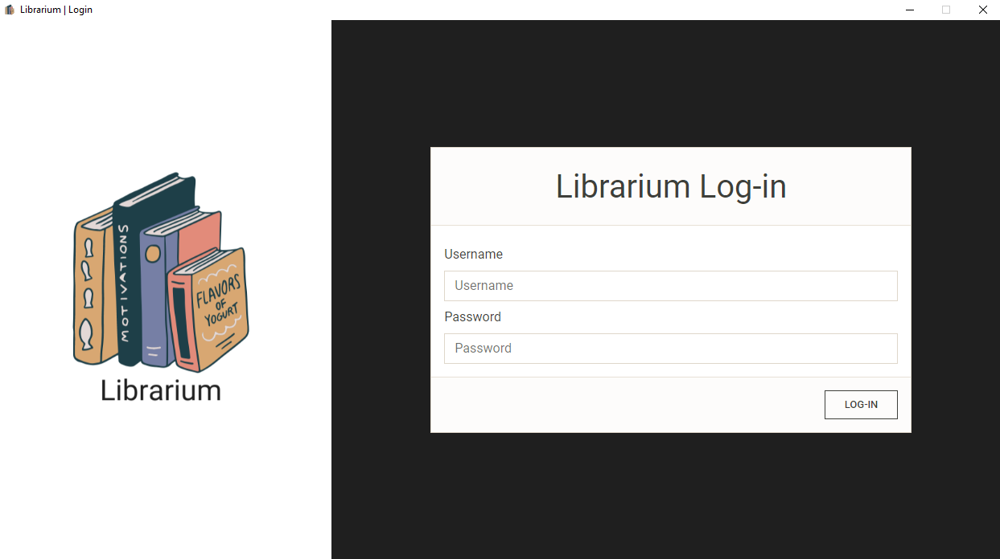
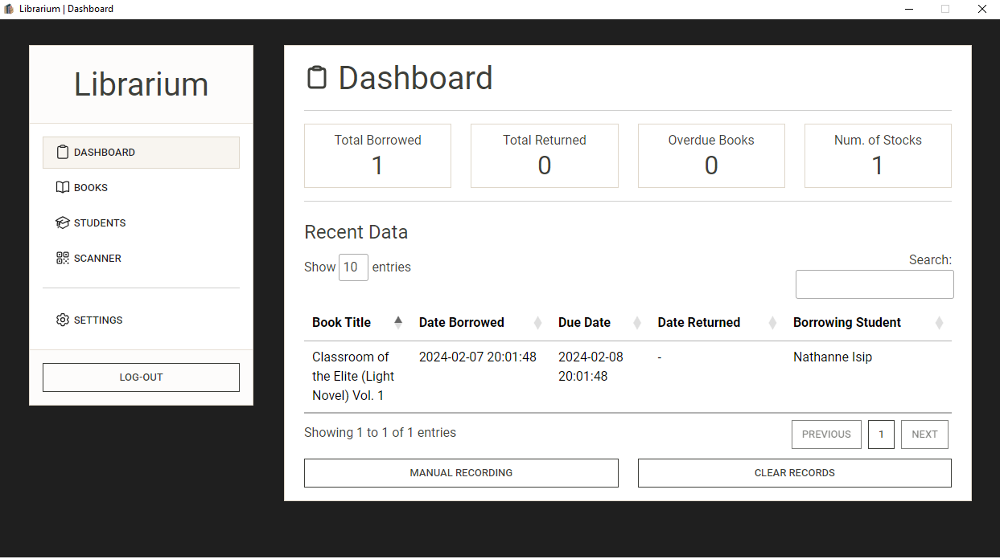
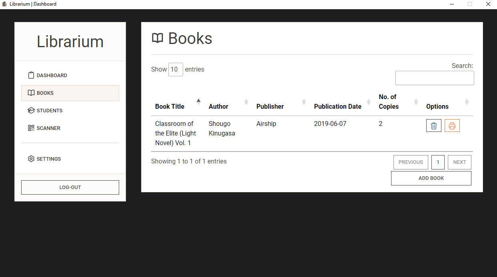
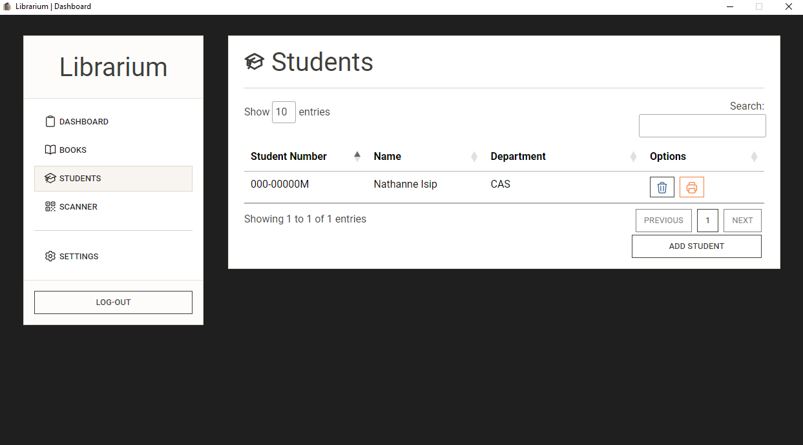
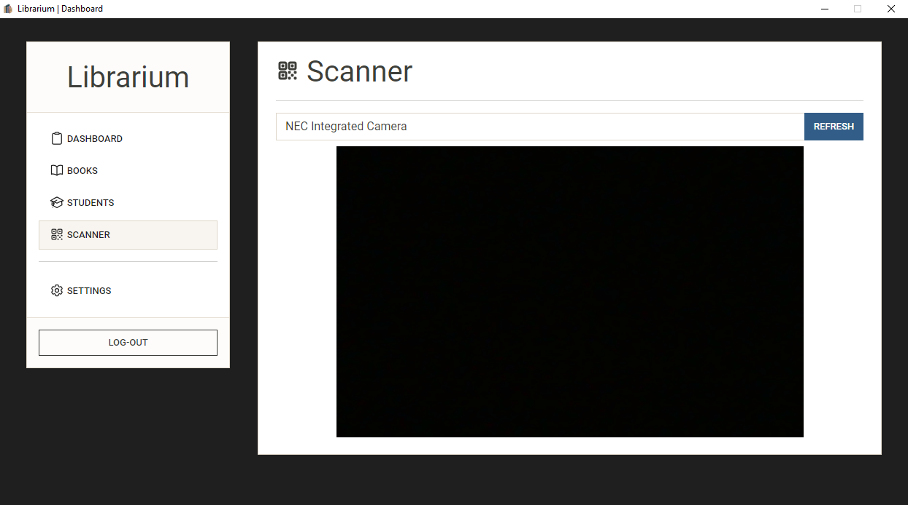

<p align="center">
    
</p>

# librarium

Librarium is a semi-automated library book borrowing and returning system built using Electron and pure JavaScript. It provides a user-friendly interface for managing library resources, including adding books and users, generating printable QR codes for books and students, and recording transactions.

## Features

- **Book Management**: Easily add, edit, and remove books from the library database.
- **User Management**: Add and manage users, such as students or library members.
- **QR Code Generation**: Generate printable QR codes for books and users, making it easy to track borrowing and returning.
- **Automated Scanning**: Utilizes an Arduino ultrasonic sensor and webcam to automatically scan QR codes when books are borrowed or returned.
- **Manual Transaction Recording**: Users can manually record transactions if needed, providing flexibility in the borrowing and returning process.

## Getting Started

To get started with Librarium, follow these steps:

1. Clone the Librarium repository to your local machine using the following command:

```bash
git clone https://github.com/nthnn/librarium.git --depth 1
```

2. Navigate to the project directory and install the necessary dependencies using npm:

```bash
cd librarium && npm install && cd librarium-app && npm install && cd ..
```

3. Start the application by running the following command:

```bash
npm run start
```

Alternatively, the command below can build the librarium as a Desktop app:

```bash
npm run pack-up
```

4. Follow the Arduino [schematics](./assets/schematics.png) (as shown below) and then upload the [librarium-firmware](librarium-firmware) to your Arduino UNO or any board of your choice. Then, ensure that your Arduino ultrasonic sensor and webcam are connected to your computer and properly configured.



5. Once the application is running, you can start managing your library resources, adding books, users, and recording transactions. Also, note that users must scan the book's QR code first before the student's QR code.

> [!NOTE]  
> The default username and password is "admin".

## Screenshots


<p align="center">Librarium Start-up Splashscreen</p>

---


<p align="center">Administrator Log-in Page</p>

---


<p align="center">Dashboard Admin View<p>

---


<p align="center">Book Management Section</p>

---


<p align="center">User Management Section</p>

---


<p align="center">Web Camera Selection Panel</p>

## License

Copyright 2024 - Nathanne Isip

Permission is hereby granted, free of charge, to any person obtaining a copy of this software and associated documentation files (the “Software”), to deal in the Software without restriction, including without limitation the rights to use, copy, modify, merge, publish, distribute, sublicense, and/or sell copies of the Software, and to permit persons to whom the Software is furnished to do so, subject to the following conditions:

The above copyright notice and this permission notice shall be included in all copies or substantial portions of the Software.

THE SOFTWARE IS PROVIDED “AS IS”, WITHOUT WARRANTY OF ANY KIND, EXPRESS OR IMPLIED, INCLUDING BUT NOT LIMITED TO THE WARRANTIES OF MERCHANTABILITY, FITNESS FOR A PARTICULAR PURPOSE AND NONINFRINGEMENT. IN NO EVENT SHALL THE AUTHORS OR COPYRIGHT HOLDERS BE LIABLE FOR ANY CLAIM, DAMAGES OR OTHER LIABILITY, WHETHER IN AN ACTION OF CONTRACT, TORT OR OTHERWISE, ARISING FROM, OUT OF OR IN CONNECTION WITH THE SOFTWARE OR THE USE OR OTHER DEALINGS IN THE SOFTWARE.